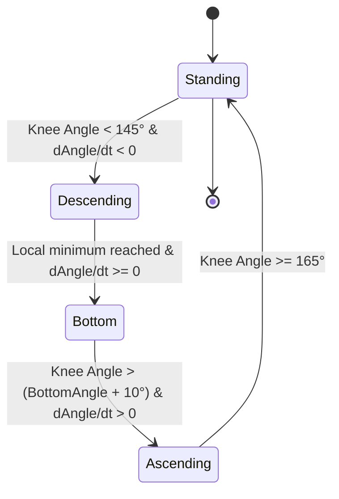

# FormCoach — Biomechanics Analysis Engine

## 1. Mathematical Principles

All kinematic metrics in FormCoach are computed deterministically using standard vector geometry and time-series analysis.

---

## 2. Joint Angle Calculation

For three anatomical landmarks $A$, $B$, and $C$, where $B$ is the vertex (e.g. $A = \text{Hip}$, $B = \text{Knee}$, $C = \text{Ankle}$):

### 2D Vector Geometry
1. Compute vectors:
   $$\vec{u} = \vec{A} - \vec{B} = (x_A - x_B, y_A - y_B)$$
   $$\vec{v} = \vec{C} - \vec{B} = (x_C - x_B, y_C - y_B)$$
2. Compute dot product and magnitudes:
   $$\vec{u} \cdot \vec{v} = u_x v_x + u_y v_y$$
   $$\|\vec{u}\| = \sqrt{u_x^2 + u_y^2}, \quad \|\vec{v}\| = \sqrt{v_x^2 + v_y^2}$$
3. Compute angle in radians and convert to degrees:
   $$\theta = \arccos\left(\text{clamp}\left(\frac{\vec{u} \cdot \vec{v}}{\|\vec{u}\| \|\vec{v}\|}, -1.0, 1.0\right)\right)$$
   $$\theta_{\text{deg}} = \theta \times \frac{180}{\pi}$$

---

## 3. Repetition Segmentation State Machine

To prevent noisy threshold triggers and frame jitter from double-counting reps, each exercise analyzer implements a deterministic state machine with hysteresis.

### Squat State Machine

### State Transition Invariants:
1. **Minimum Rep Duration**: A complete repetition cycle must take $\ge 0.8$ seconds (rejects high-frequency camera shakes).
2. **Minimum Range of Motion**: The delta between `standingKneeAngle` and `bottomKneeAngle` must exceed $35^\circ$.
3. **Hysteresis Guard**: Transition from `Ascending` back to `Standing` requires reaching $\ge 165^\circ$, preventing false re-triggers during lockout tremors.

---

## 4. Derived Kinematic Metrics

### 4.1 Range of Motion (ROM)
- **Primary ROM**: Minimum knee angle reached at the inflection point (degrees).
- **Hip Translation Proxy**: Vertical displacement of hip landmark normalized by femur length:
  $$\text{Depth Ratio} = \frac{y_{\text{hip, bottom}} - y_{\text{hip, standing}}}{\|\vec{P}_{\text{hip}} - \vec{P}_{\text{knee}}\|}$$

### 4.2 Tempo & Phase Segmentation
- **Eccentric Duration**: $t_{\text{bottom}} - t_{\text{descending\_start}}$
- **Bottom Pause Duration**: Time spent within $\pm 5^\circ$ of peak flexion.
- **Concentric Duration**: $t_{\text{standing}} - t_{\text{ascending\_start}}$
- **Total Rep Duration**: $t_{\text{standing}} - t_{\text{descending\_start}}$

### 4.3 Form Consistency & Degradation
- **Standard Deviation**: Compute $\sigma_{\text{ROM}}$ and $\sigma_{\text{tempo}}$ across all completed reps.
- **Fatigue / Degradation Ratio**: Compare early-set reps (first $\min(4, N/2)$ reps) against late-set reps (last $\min(4, N/2)$ reps):
  $$\Delta_{\text{ROM}} = \frac{\bar{\text{ROM}}_{\text{late}} - \bar{\text{ROM}}_{\text{early}}}{\bar{\text{ROM}}_{\text{early}}} \times 100\%$$
- When $\Delta_{\text{ROM}} < -10\%$ with confidence $\ge 0.85$, trigger the explainable observation:
  > *"Knee range of motion decreased by ~X% during the final 4 repetitions."*

---

## 5. Confidence Scoring Engine

Analysis confidence is a multi-factor metric:
$$\text{Confidence} = w_1 C_{\text{visibility}} + w_2 C_{\text{tracking}} + w_3 (1.0 - C_{\text{gaps}})$$
- $C_{\text{visibility}}$: Percentage of required landmarks detected above confidence threshold $0.5$.
- $C_{\text{tracking}}$: Mean confidence across primary active joints (hips, knees, ankles).
- $C_{\text{gaps}}$: Fraction of missing/interpolated frames during active rep phases.
- **Thresholds**:
  - $\ge 0.85$: `GOOD` (Full analysis displayed)
  - $0.65 - 0.84$: `LIMITED` (Analysis displayed with caveat banner)
  - $< 0.65$: `INSUFFICIENT` (Analysis withheld; framing feedback displayed)
