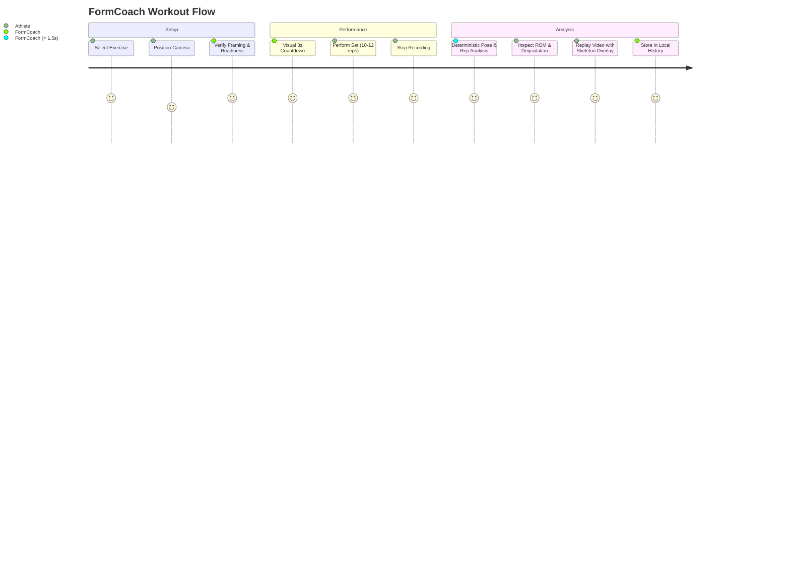

# FormCoach — Product Specification

## 1. Executive Summary

**FormCoach** is a native iOS application designed for the iPhone (primary target: iPhone 17) that records strength-training exercises and analyzes exercise form locally using computer vision and deterministic biomechanics.

### Core Promise
> *Put the iPhone down at the gym, record a set, and immediately receive an evidence-based analysis of repetitions, range of motion, tempo, symmetry, consistency, and observable form — without uploading the video to a paid AI service.*

---

## 2. Core Value Proposition & Principles

1. **Native iOS & iPhone First**: Crafted in Swift and SwiftUI utilizing Apple's hardware-accelerated AVFoundation and Vision frameworks.
2. **Local-First & Offline**: 100% of video processing, pose estimation, and biomechanics calculations execute on-device. Zero cloud requirement.
3. **Zero Marginal Operating Cost**: 0 DKK / 0 USD per workout. No OpenAI, Gemini, Anthropic, or paid cloud inference APIs.
4. **Privacy-First**: No account creation, no user tracking, no video uploads, no facial recognition or biometric profiling.
5. **Deterministic Biomechanics**: Movement interpretation is derived from vector geometry, kinematics, and calibrated state machines—not generative AI hallucinations.
6. **Scientific Humility**: The app assesses visible movement kinematics. It does not pretend to diagnose medical injuries or calculate internal joint loads.
7. **Gym-Ready Glanceability**: Designed for noisy commercial gyms (e.g. PureGym). No mandatory audio cues, oversized touch targets, and high-contrast visual statuses.

---

## 3. Product Boundaries (What FormCoach is NOT)

- NOT a generic fitness tracker or workout planner
- NOT a calorie or nutrition counter
- NOT a social media network or video sharing portal
- NOT an LLM conversational chatbot
- NOT an injury diagnostic tool or medical device
- NOT a cloud-dependent SaaS subscription

---

## 4. User Journey

---

## 5. M1 Feature Scope (Squat Reference Implementation)

- **Exercise Selection**: Bodyweight & Goblet Squat.
- **Camera Setup Coach**: Visual validation of full-body visibility (head, hips, knees, ankles) and camera angle suitability.
- **Gym Recording Mode**: Large REC indicators, elapsed time, optional 60fps live skeleton overlay.
- **Automated Rep Segmentation**: 5-state hysteresis state machine (`Standing`, `Descending`, `Bottom`, `Ascending`, `Standing`).
- **Kinematic Metrics**:
  - Repetition Count
  - Knee Range of Motion (flexion angle at bottom)
  - Rep Tempo (eccentric, bottom pause, concentric duration)
  - Movement Consistency (early-set vs late-set ROM degradation)
  - Torso Angle & Hip Translation proxy
  - Tracking Confidence Score
- **Video & Pose Replay**: Scrubbable playback with joint skeleton and angle overlays, with single-tap navigation to individual repetitions.
- **Local Persistence**: SwiftData historical log with cascade file cleanup.
